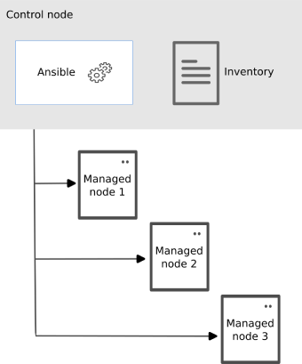

# Ansible 101

Ansible automates the management of remote systems and controls their desired
state. A basic Ansible environment has three main components:

- **Control node**: A system on which Ansible is installed and where ansible
commands are run;

- **Managed node**: A remote system, or host, that Ansible controls through its **inventory**;

- **Inventory**: A list of managed nodes that are logically organized. You create
an inventory on the **control node** to describe host deployments to Ansible.

Ansible mainly relies on `yaml` files and [Jinja2 templating system](https://jinja.palletsprojects.com/en/3.1.x/templates/#template-designer-documentation).

## Tasks, variables and Playbooks

Ansible **tasks** are statements that describe a desiderable state.
State can be espressed by using ansible [modules](https://docs.ansible.com/ansible/2.9/modules/modules_by_category.html).
Variables can be set by:

- using [set\_fact](https://docs.ansible.com/ansible/latest/collections/ansible/builtin/set_fact_module.html)
module that allows setting variables associated to the current scope;

- [by declaring](https://docs.ansible.com/ansible/latest/user_guide/playbooks_variables.html#where-to-set-variables)
a variable in a playbook vars section, or into other locations.

You can import statically or include dinamically external tasks with modules like
[import\_tasks](https://docs.ansible.com/ansible/latest/collections/ansible/builtin/import_tasks_module.html)
or [include\_tasks](https://docs.ansible.com/ansible/latest/collections/ansible/builtin/include_tasks_module.html).

Tasks are grouped into **Ansible Playbooks**.

## Roles

[Roles](https://docs.ansible.com/ansible/latest/user_guide/playbooks_reuse_roles.html#roles)
let you automatically load related vars, files, tasks, and other Ansible artifacts
based on a known file structure. After you group your content in roles, you can
easily reuse them.

A role has the following recommended folder/entrypoint layout:

- `tasks/main.yml`: the list of tasks that the role executes.
- `defaults/main.yml`: default variables for the role (see
[Using Variables](https://docs.ansible.com/ansible/latest/user_guide/playbooks_variables.html#playbooks-variables)).
  - These variables have the lowest priority of any available variables, and
  can be easily overridden when reusing the role.
- `vars/main.yml`: other variables for the role (see
[Using Variables](https://docs.ansible.com/ansible/latest/user_guide/playbooks_variables.html#playbooks-variables)).
- `files/main.yml`: files that the role deploys.
- `templates/main.yml`: templates that the role deploys.

Roles can be stored in [different ways](https://docs.ansible.com/ansible/latest/user_guide/playbooks_reuse_roles.html#storing-and-finding-roles):
they can then be statically imported or included dinamically with the [import\_role](https://docs.ansible.com/ansible/latest/collections/ansible/builtin/import_role_module.html)
and the [include\_role](https://docs.ansible.com/ansible/latest/collections/ansible/builtin/include_role_module.html)
modules.
