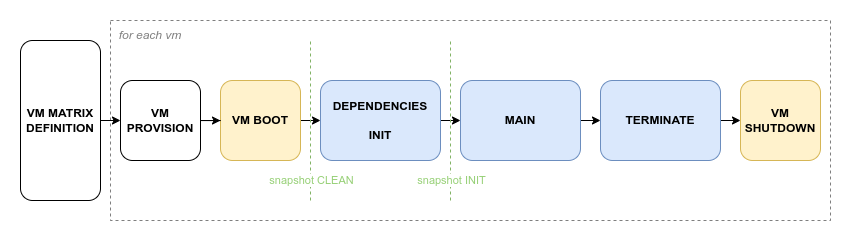

This is an example of a project test. In here both the actual tests and the
definitions of the needed vms are present.

# Usage

### Setup

TODO

### Run

Execute:

```
ansible-playbook main.yaml -K
```

This will go trough all provision and test phases and will result in two
files in a `out` folder:

  - `out.xml`: a `junit2` file containing all tests results; this includes
  failed tests with their stack trace;

  - `out.html`: included only for this demo, it's a possible way to visualize
  the test data contained in the `out.xml` output file (produced by
  [junit2html](https://pypi.org/project/junit2html/)).

# Project structure

This is a somewhat minimal example that includes one vm definition (a
virtualsquare vm on a KVM x86\_64 machine) and a `pexpect` test that reproduce
a [v2 wiki test](http://wiki.virtualsquare.org/#!tutorials/vde_ns.md#Scenario:_two_vdens_and_a_switch).

## Test lifecycle




The first step is to prepare the vm matrix definition (we just
have one vm, here); then, for each defined vm, the main test loop is started.

After provisioning and booting the vm, the first libvirt snapshot (called
`clean`) is taken. This will come in handy to clean the slate after a failure in
preparing the vm in the next phase.

During the `dependencies` and `init` phases, all required test dependencies are installed
in the vm. If successful another snapshot is taken, called `init`: it can be
used by the test if it needs to start from a safe point (but with all the dependencies
already installed!).

The `main` phase is responsible to run the actual tests: this may include compiling
from the source code, launching the test suite, recovering tests output, etc.

Just before shutting down the vm, the `terminate` phase will take care of
eventual clean ups.

## The entrypoint: [main.yaml](main.yaml)

This playbook takes care of parsing vms definitions, provisioning them and run
all tests phases. This is accomplished by using several Test Deploy roles:

- `parse_vms_definition` simply parses all definition files;

- `init_vm_connection` add all defined vms to the ansible inventory;

- `kvm_provision` create the vm;

- `guest_provision` is responsible of starting the vm, handling the snapshot, starting
  the test phases and finally shutting down the vm.

## Farm setup and VMs Definitions

TODO

### setup\_hypervisor

TODO definizione della rete

### vms\_config.yaml

TODO

### setup\_vm

TODO 

### group\_vars

TODO 

## Test phases

TODO

### dependencies.yaml and init.yaml

TODO

### main.yaml

TODO

### terminate.yaml

TODO

## PExpect Test

TODO

